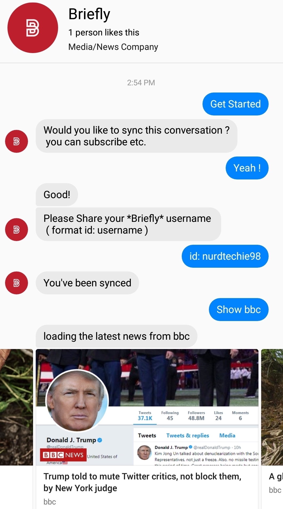
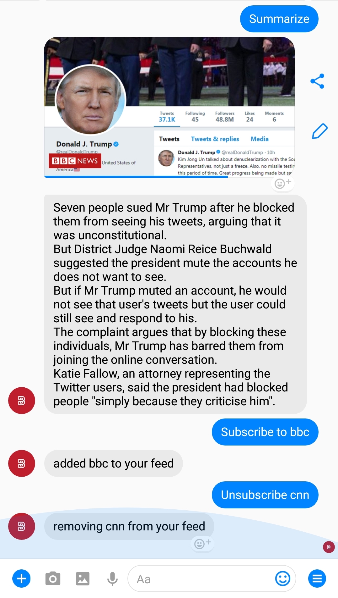

  

<h3 align="center">Source based news network</h3>

------------------------------------------

>There are no personalized , summary based  news resources available in the current scenario . We've built a `Source based news network` where the user has the control over the feed from any given `source` in any given `language` .

&#10077; It's the user who decides what he needs &#10078;  -  cheetAh

------------------------------------------
### Features

- Subscriptions for a news source
- Bookmark an article
- Summarize an source article or a url
- Browse across ~ 255 preffered source listed [here]()
- Featured Article as per all user reaction ( Also an Add-Ons )
- Night-Mode for better readiblity

<h3 > Briefly Web-App  </h3>

<h3 > Briefly On Messenger  </h3>

------------------------------------------

### Add-Ons

- [ ] Offline news feed for subscriptions
- [ ] Daily Mail ( yet to be integrated with template )
- [ ] Add

### File Structure

#### ChatBot

- App : Source code for chatbot
- Scrappers : Scrapper for maintaining inital news distribution across web-app and chatbot using firebase

#### Web-App

- Repository [here](https://github.com/inishchith/Briefly-web/tree/master)

------------------------------------------
### Contributing

 We're are open to enhancements & bug-fix . also do have a look [here](./CONTRIBUTING.md)

------------------------------------------
### Note

- This project was done under 24 hours with minimal pre-preparation
- Extended capabilities of scraper to Indian Languages ( Hindi & Marathi supported as of now)

------------------------------------------
### Recognition

This repository / project was a part of [Mumbai Hackathon 2018](https://mumbaihackathon.in/)
